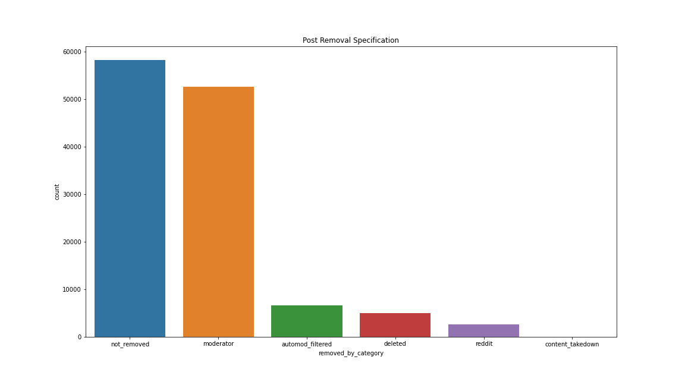
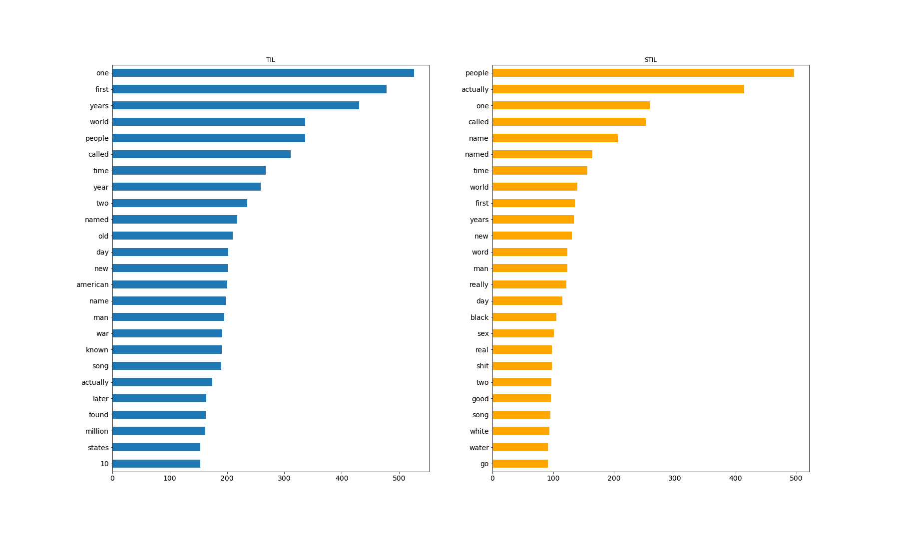
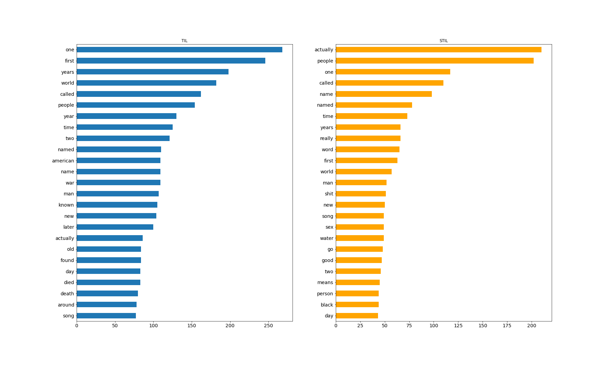
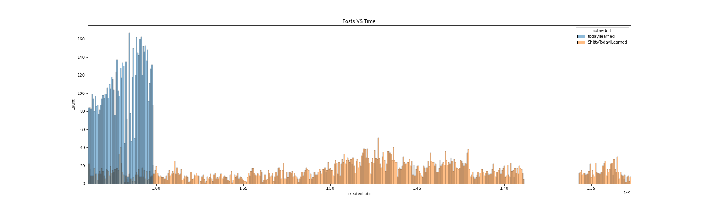
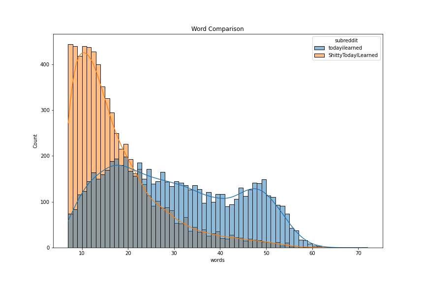
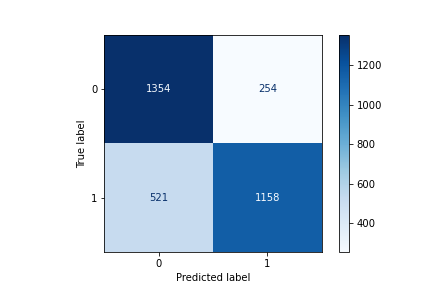
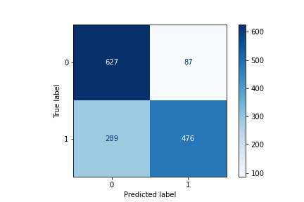

# Distinguishing Between Subreddits

## Problem Statement

**How well can a data model distinguish a subreddit from a parody? 
Will curating for popular posts lead to a more successful model?**

## r/TodayILearned vs r/ShittyTodayILearned

r/TodayILearned example: TIL that the F.B.I. and C.I.A. recruit heavily from the Mormon population because they are usually cheaper to do a security clearance on, they often speak another language from their mission trips and they usually have a low risk lifestyle.

r/ShittyTodayILearned example: TIL The press used to mint coins is called a pounder and state quarters can have backs so low profile they require a special pounder fitted with a piece of cheese cloth to prevent the hot metal from sticking. This device is called a quarter pounder with cheese.

r/TIL is a subreddit of accurate and interesting facts meant to inform the community, while r/STIL is a subreddit of jokes pretending to be accurate and interesting facts. Both follow the same format, where posts are composed only of their title and no body text. Each post is also only one fact. However, where r/TIL has an extensive set of rules that moderators check each post with, r/STIL's only rules are "no reposts, no memes, no Rickrolling." Very few posts r/STIL are actually moderated.

## Methodology

The plan is to set up a base model using as many r/STIL posts that meet certain standards. I will then take an equal amount of r/TIL posts. After running multiple classification models, I will run GridSearches for the most successful models. 

I will then further curate the dataset to see if well like posts can lead to a more successful model. The new dataset will run through the same classification models, as well as set up GridSearches for the successful models.

## Data Dictionary

Below are custom features and the methodology for them:

| Field                    	| Description                                    	| Data Type 	|
|--------------------------	|------------------------------------------------	|-----------	|
| title              	| The the body of the post.      	| str       	|
| created_utc              	| The time of post creation, in terms of Coordinated Universal Time.           	| int       	|
| score              	| Total number of upvotes a post receives. All posts start with 1.            	| int       	|
| subreddit (Steps 1 - 3)  	| The subreddit the post was posted in. | str     	|
| subreddit (Step 4)       	|  0 = ShittyTodayILearned. 1 = TodayILearned 	| int     	|
| words          	| Total number of words in the post 	| int    	|
| characters            	| Total number of characters in the post.                	| int   	|
| removed_by_category      	| Who removed the post. NaN = Post was not removed        	| str    	|

## Data Cleaning

r/TIL Total Posts: 124,923
r/STIL Total Posts: 7,862

(r/TIL) Remove the Removed Posts:

Posts are removed from r/TIL when they don't meet the subreddit's standards. I do not think these posts will be a good representation for classifying and will remove them, totaling 53.4% of r/TIL's current posts

r/TIL Total Posts: 58,184
r/STIL Total Posts: 7,862

(r/STIL) No Posts about Reddit:
r/TIL makes sure no posts references Reddit, while a sizable amount of r/STIL are joke posts about Reddit and will make it artificially easier to classify between subreddits. Although this removal will likely lower our models' accuracy, I am more interested in making classifiers that differentiate between the more difficult posts. This will remove 4.5% of r/STIL's posts

r/TIL Total Posts: 58,184
r/STIL Total Posts: 7,508

(Both) Remove Posts 6 words or less:
After looking at posts of varying lengths from both subreddits, I feel that a good majority of posts 7 words or greater have enough substance behind them to potentially correctly classify them, while this substance drastically falls apart for posts of 6 words or less. This will remove 9.3% of r/STIL posts and 1.4% of r/TIL posts.

r/TIL Total Posts: 57,369
r/STIL Total Posts: 6,810

(Both) Drop Duplicates:
Whether a user double posted their content, or the scraper picked up some data multiple times, these posts only add noise to the model and should be dropped.

r/TIL Total Posts: 56,149
r/STIL Total Posts: 6,573

(r/TIL) Grab r/TIL posts for Method One:
All of r/STIL now meet my standard for Method One. I will randomly grab r/TIL posts that will equal r/STIL posts. This accounts for only 11.7% of r/TIL posts.
**r/TIL Posts: 6,573**
**r/STIL Posts: 6,573**

(Both) Drop posts with scores < 10:
In order to see if these subreddits can curate their own content to build a better classifier, I will drop posts that did not receive many or any upvotes. This is only 45% of r/STIL posts and just 6% of available r/TIL posts.

r/TIL Total Posts: 3,391
r/STIL Total Posts: 2,958

(r/TIL) Grab r/TIL posts for Method Two:
All of r/STIL now meet my standard for Method Two. I will randomly grab r/TIL posts that will equal r/STIL posts. This accounts for 87.2% of r/TIL posts.
**r/TIL Posts: 2,958**
**r/STIL Posts: 2,958**

## Data Visualization

The top 25 words for Method One:

The top 25 words for Method Two:

### Dataset Imbalances

## Model One: Total

| Classifier              	| Training Accuracy                                    	| Testing Accuracy 	|
|--------------------------	|------------------------------------------------	|-----------	|
| CV Logistic Regression              	| 0.986      	| 0.764       	|
| CV Decision Trees              	| 0.999           	| 0.672       	|
| CV Gradient Boost              	| 0.716  	| 0.671       	|
| CV ADA Boost  	| 0.679  | 0.662     	|
| CV Bagging      	|  0.975 	| 0.694     	|
| TFID Logistic Regression          	| 0.953 	| 0.757    	|
| TFID Decision Trees            	| 0.999               	| 0.685   	|
| TFID Random Forest      	| 0.999  	| 0.683    	|
| TFID Extra Trees      	|  0.999 	| 0.753     	|
| TFID Gradient Boost      	| 0.744 	| 0.702    	|
| TFID ADA Boost      	| 0.673  	| 0.652    	|
| TFID Bagging           	| 0.978              	| 0.726  	|

Most classifiers fall into a testing accuracy of 70%. However, 3 models stand above the rest: CV Logistic Regression, TFID Logistic Regression, and TFID Extra Trees.   

| GridSearch Classifier    | Training | Tr Diff | Testing | Te Diff |
|--------------------------|----------|---------|---------|---------|
| CV Logistic Regression   | 0.976    | -1.02%  | 0.762   | -0.26%  |
| TFID Logistic Regression | 0.887    | -7.17%  | 0.749   | -1.06%  |
| TFID Extra Trees         | 0.993    | -0.60%  | 0.760   | 0.92%   |

The GridSearches led to slightly better fitting models, but to the detriment of testing accuracy. These models are close, but looking to specificity as a tiebreaker, the best model is:
**CV Logistic Regression**

* Specificity: 0.842
* Precision: 0.820
* Recall: 0.690

## Model Two: Score

| Classifier              	| Training Accuracy           	| Testing Accuracy 	|
|--------------------------	|------------------------------	|-----------	|
| CV Logistic Regression   	| 1.000      	| 0.766      	|
| CV Decision Trees        	| 1.000          	| 0.694       	|
| CV Gradient Boost        	| 0.776  	| 0.684       	|
| CV ADA Boost  	| 0.730  | 0.674    	|
| CV Bagging      	|  0.979 	| 0.709     	|
| TFID Logistic Regression  | 0.981 	| 0.761   	|
| TFID Decision Trees      	| 1.000               	| 0.705   	|
| TFID Random Forest      	| 1.000  	| 0.703    	|
| TFID Extra Trees      	|  1.000 	| 0.744   	|
| TFID Gradient Boost      	| 0.792 	| 0.708    	|
| TFID ADA Boost      	| 0.726  	| 0.661   	|
| TFID Bagging           	| 0.983             	| 0.733  	|

Again, most classifiers fall into a testing accuracy of 70%. Similarly, the same 3 models stand above the rest: CV Logistic Regression, TFID Logistic Regression, and TFID Extra Trees.   

| Classifier               | Training | Tr Diff | Testing | Te Diff |
|--------------------------|----------|---------|---------|---------|
| CV Logistic Regression   | 0.985   | -1.51%  | 0.771  | 0.65%  |
| TFID Logistic Regression | 0.919    | -6.53% | 0.763   | 0.26% |
| TFID Extra Trees         | 0.872    | -13.68%  | 0.773   | 3.82% |

These GridSearches lead to much better fitting models compared to Method One. Additionally, all testing accuracy increased as well. These models are close one again, but looking to specificity as a tiebreaker, the best model is:
**TFID Extra Trees**

* Specificity: 0.877
* Precision: 0.845
* Recall: 0.629

## Analysis

* Method 2 (TFID Extra Trees, 77.3%) slightly outperformed Method 1 (CV Logistic Regression, 76.0%)
* Almost all classifiers were extremely overfit
* Most classifiers fell around 70% prediction rate, compared to 50% baseline
* The lower accuracy of the models is most likely caused by a lot of overlap between subreddits
* The models also have no ability to "fact check" the statements, hurting its accuracy as well

## Data to consider

* Getting a dataset for r/TIL that matches date posted as r/STIL would lead to a more realistic model
* Method 2 led to slight improvements, and might lead to greater improvements further increasing score minimum

## Appendix: Beat the Model

Can you do better than the best classifier? Below are 3 True Positives (model guessed r/TIL, post was r/TIL) and one False Positive (model guessed r/TIL, post was r/STIL). Can you guess which one?

1. TIL of Yoshie Shiratori, who escaped from prison 4 times. First, he picked a lock, then he climbed the walls and escaped through a skylight. Third, through a narrow food slot in his door, and finally he dug a tunnel out. He was recaptured each time, and eventually released for good behavior.

2. TIL after an obese umpire died during a game, Major League Baseball decided to enforce weight limits. In 1999 under this policy, umpire Eric Gregg was fined $5,000 for exceeding 300lbs.

3. TIL The original American Transcontinental Railroad was a major undertaking which took many years to build. It was built for the sole purpose of making it easier to move people and stuff.

4. TIL about Null Island, the place where the Prime Meridian and Equator meet. It is a fictitious island with the geographical coordinates of 0,0 - off the coast of Africa. And it only exists in geographical databases to highlight data errors.
 
 
 
 
 
 
 
 
 
 
 
 
 
 
 
 
 
 
 
 
**Answer: 3!**